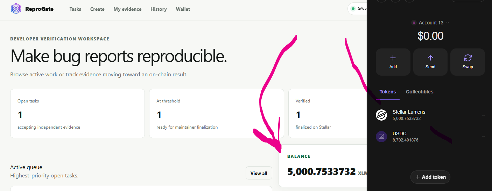
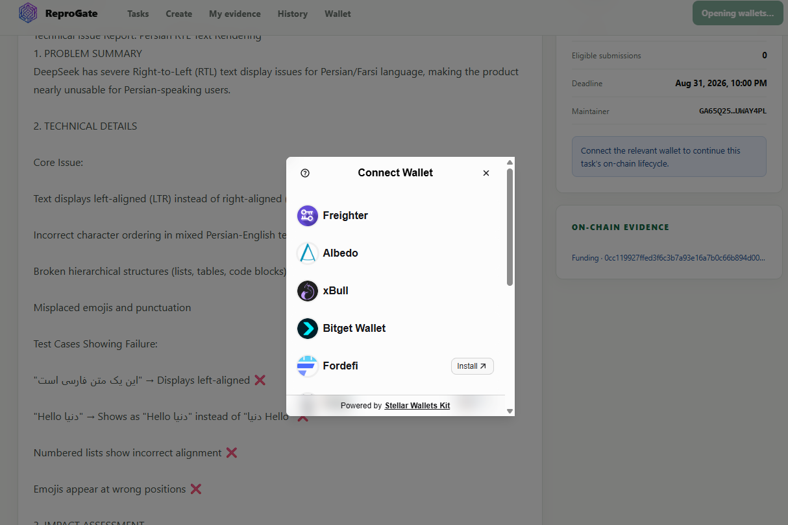
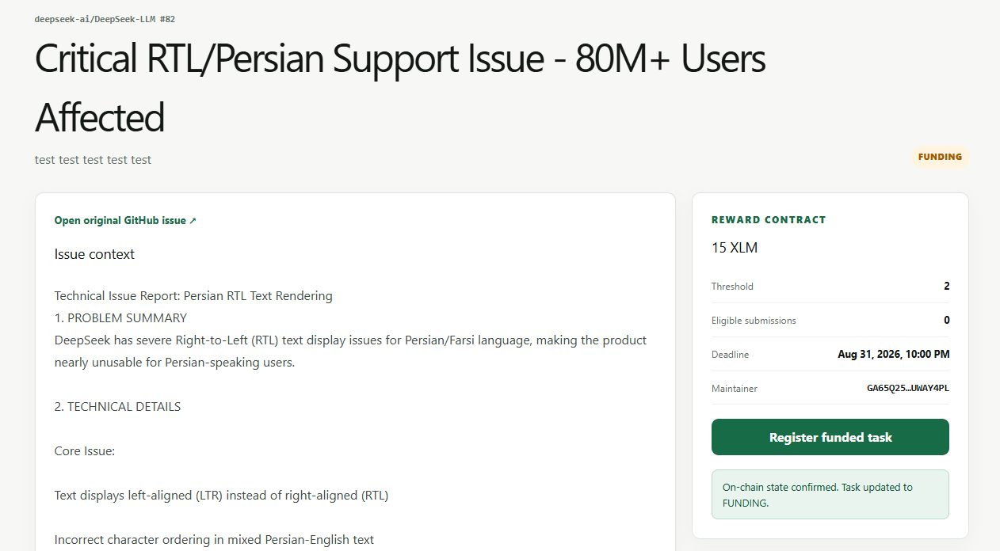
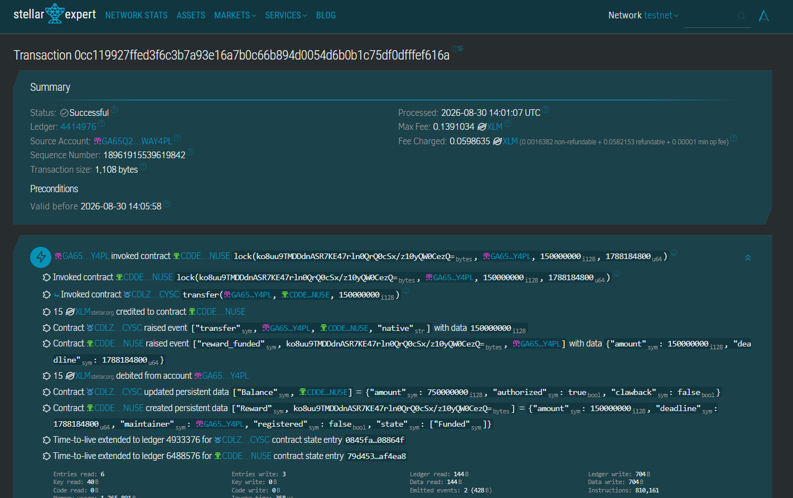
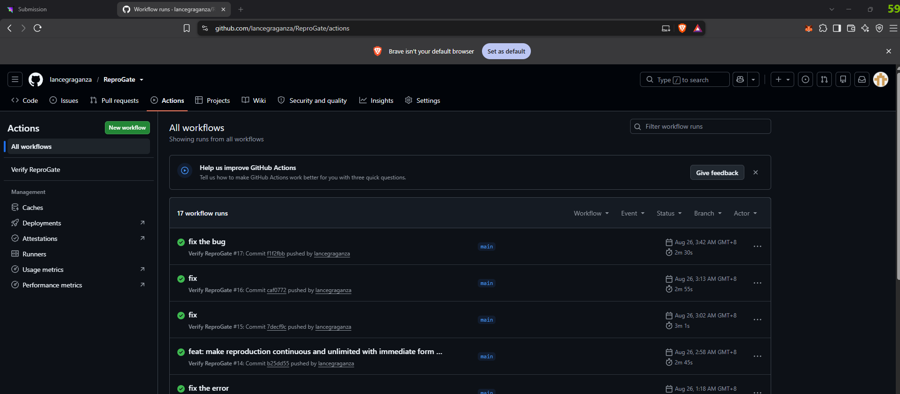
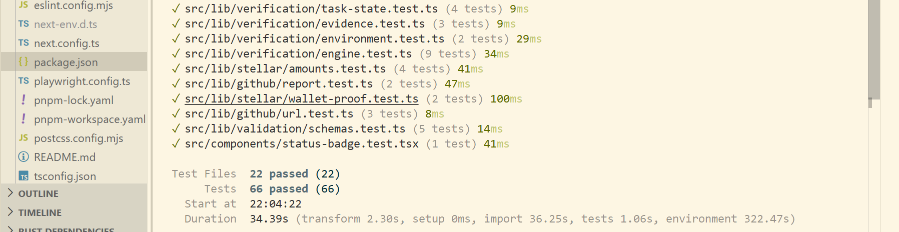
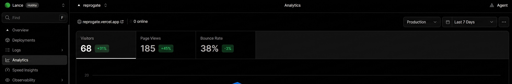

<p align="center">
  <a href="https://reprogate.vercel.app">
    
  </a>
</p>

<h1 align="center">ReproGate</h1>

<p align="center">
  <strong>Independent bug reproduction with transparent Stellar Testnet rewards.</strong>
</p>

<p align="center">
  <a href="https://reprogate.vercel.app"><strong>Open live app</strong></a>
  &nbsp;·&nbsp;
  <a href="https://drive.google.com/file/d/1HReYg2t4AhHkH4xtza2qyRFmGNcQGMV3/view?usp=sharing">Watch demo</a>
  &nbsp;·&nbsp;
  <a href="https://docs.google.com/presentation/d/1R74O0kwGcITF7PWbGZxlcyIFtkiRn4oq/edit?usp=sharing">View pitch deck</a>
  &nbsp;·&nbsp;
  <a href="https://docs.google.com/spreadsheets/d/1CSuM52ziJfu3tocQkOn5U-fDWawdnnk9WCI7uV0Em1M/edit?usp=sharing">Open feedback sheet</a>
</p>

ReproGate imports a public GitHub issue, collects structured evidence from independent wallets, compares the results, finalizes the verified outcome through Soroban, and distributes the locked XLM reward.

```text
GitHub issue → Fund reward → Submit evidence → Reach threshold
             → Registry finalizes → Vault pays contributors → History updates
```

> **Network:** Stellar Testnet only. Evidence and logs stay off-chain. Reward funding, final state, and payouts are publicly verifiable.

## Judge trail — five links first

1. **Use the product:** [reprogate.vercel.app](https://reprogate.vercel.app)
2. **Verify 61 transacting wallets and 71 successful transactions:** [generated JSON](docs/user-activity-verification.json)
3. **Inspect real Soroban finalization and Vault distribution:** [Stellar Expert transaction](https://stellar.expert/explorer/testnet/tx/de2df7e733bd2d19624c9a94a0b42491226bc811c0afe1ab77fa245788dbc038)
4. **Inspect the passing engineering gates:** [latest successful GitHub Actions run](https://github.com/lancegraganza/ReproGate/actions/runs/33318809437)
5. **Review the presentation:** [demo video](https://drive.google.com/file/d/1HReYg2t4AhHkH4xtza2qyRFmGNcQGMV3/view?usp=sharing) and [pitch deck](https://docs.google.com/presentation/d/1R74O0kwGcITF7PWbGZxlcyIFtkiRn4oq/edit?usp=sharing)

## Proof dashboard

> **67 recorded wallets** · **61 wallets with successful evidence payments** · **71 successful ReproGate transactions** · **0 Horizon rejections**

- Transaction breakdown: **61 evidence payments, 5 reward-funding calls, 4 Registry calls, and 1 finalization**.
- Public form snapshot: **57 rows, 57 unique wallet addresses, and all 57 wallets match the database**.
- Analytics screenshot: **68 visitors and 185 page views**.
- Repository history: **38 commits** covering contracts, the application, tests, CI/CD, deployment, and automation.

Run the proof yourself from the repository root:

```powershell
node scripts/verify-user-activity.mjs
```

[`scripts/verify-user-activity.mjs`](scripts/verify-user-activity.mjs) reads the configured ReproGate database and checks every confirmed hash against Stellar Testnet Horizon. It writes a compact [`docs/user-activity-verification.json`](docs/user-activity-verification.json) containing only the verified totals, required wallet addresses, successful transaction hashes, and Explorer link templates. The counts are calculated, not hardcoded.

> [!IMPORTANT]
> The blockchain activity is real. The 61 transacting accounts and 57 Google Form responses were produced by ReproGate's Testnet automation. They prove the complete multi-wallet blockchain flow, but they do not prove 61 different human users.

## Required visual evidence

Every preview below is clickable.

<table>
  <tr>
    <td width="50%" align="center">
      <a href="docs/wallet-connected-state_Balancedisplayed.png">
        
      </a>
      <br /><strong>Connected wallet + XLM balance</strong>
    </td>
    <td width="50%" align="center">
      <a href="docs/wallet-options.png">
        
      </a>
      <br /><strong>Multi-wallet selection</strong>
    </td>
  </tr>
  <tr>
    <td width="50%" align="center">
      <a href="docs/transaction-result-is-shown-to-the-user.png">
        
      </a>
      <br /><strong>Confirmed state shown in the app</strong>
    </td>
    <td width="50%" align="center">
      <a href="docs/testnet-transaction.png">
        
      </a>
      <br /><strong>Successful Testnet contract transaction</strong>
    </td>
  </tr>
</table>

## Belt verification

### ⚪ Level 1 — White Belt

**Status: verified**

- [x] Freighter and Stellar Testnet — [wallet code](web/src/features/wallet/wallet-provider.tsx) · [wallet screenshot](docs/wallet-connected-state_Balancedisplayed.png)
- [x] Connect, reconnect, and disconnect — [wallet provider](web/src/features/wallet/wallet-provider.tsx)
- [x] Fetch and display XLM balance — [balance component](web/src/features/wallet/balance-card.tsx) · [visual proof](docs/wallet-connected-state_Balancedisplayed.png)
- [x] Send XLM on Testnet — [transfer component](web/src/features/wallet/transfer-form.tsx) · [successful 0.1 XLM payment](https://stellar.expert/explorer/testnet/tx/737c0709f0713275f29f3cde14919cf9967a3108b11199235ffe92b543419072)
- [x] Show pending, success, failure, and transaction hash — [state mapping](web/src/lib/stellar/transaction-state.ts) · [result screenshot](docs/transaction-result-is-shown-to-the-user.png)
- [x] Public deployment, README, and 10+ commits — [live app](https://reprogate.vercel.app) · [38-commit history](https://github.com/lancegraganza/ReproGate/commits/main/)

### 🟡 Level 2 — Yellow Belt

**Status: verified**

- [x] StellarWalletsKit with multiple wallet choices — [picker screenshot](docs/wallet-options.png) · [integration](web/src/features/wallet/wallet-provider.tsx)
- [x] Wallet missing, rejected signature, insufficient balance, and wrong-network errors — [wallet handling](web/src/features/wallet/wallet-provider.tsx) · [transaction handling](web/src/lib/stellar/transaction-state.ts)
- [x] Contracts deployed on Testnet — [Repro Task Registry](https://lab.stellar.org/r/testnet/contract/CAH5OSI255VRSJJQVM6JCR77E5C52IB7Y6WCNZYVC3DH7MDSVMRLHMVI) · [Reward Vault](https://lab.stellar.org/r/testnet/contract/CDDE25PTGG2XOTQHJ25CIQRUBJ6I6Q4WLIIWSURLLWP26B5HKABWNU5E)
- [x] Frontend contract calls — [typed contract actions](web/src/lib/stellar/contract-actions.ts) · [15 XLM funding call](https://stellar.expert/explorer/testnet/tx/0cc119927ffed3f6c3b7a93e16a7b0c66b894d0054d6b0b1c75df0dfffef616a)
- [x] Transaction status and synchronized state — [task chain UI](web/src/features/tasks/task-chain-actions.tsx) · [event-sync endpoint](web/src/app/api/stellar/sync/route.ts)

### 🟠 Level 3 — Orange Belt

**Status: verified**

- [x] Two meaningful Soroban contracts — [Registry](contracts/repro-task-registry/src/lib.rs) · [Vault](contracts/reward-vault/src/lib.rs)
- [x] Real inter-contract communication — Registry `finalize` calls Vault `distribute`; [successful finalization](https://stellar.expert/explorer/testnet/tx/de2df7e733bd2d19624c9a94a0b42491226bc811c0afe1ab77fa245788dbc038)
- [x] Contract events and live reconciliation — [event reader](web/src/lib/stellar/events.ts) · [idempotent reconciler](web/src/lib/stellar/event-reconciliation.ts)
- [x] CI/CD and repeatable Testnet deployment — [passing run](https://github.com/lancegraganza/ReproGate/actions/runs/33318809437) · [workflow](.github/workflows/ci.yml) · [deployment script](scripts/deploy-testnet.ps1)
- [x] Tests and production build — **16 contract tests, 66 web tests, and 4 desktop/mobile browser tests**; [test screenshot](docs/Test-output-with-3+-passing-tests.png)
- [x] Responsive frontend, loading states, and recoverable errors — [mobile evidence below](#mobile-and-engineering-evidence) · [Playwright coverage](web/e2e/smoke.spec.ts)
- [x] Production architecture and demo — [architecture](ARCHITECTURE.md) · [network record](NETWORKS.md) · [demo video](https://drive.google.com/file/d/1HReYg2t4AhHkH4xtza2qyRFmGNcQGMV3/view?usp=sharing)

### 🟢 Level 4 — Green Belt

**Status: technical requirements verified; real-human onboarding still needs proof**

- [x] Functional deployed MVP — [open ReproGate](https://reprogate.vercel.app)
- [x] Stable frontend/backend/contract boundaries — [architecture](ARCHITECTURE.md)
- [x] Mobile UI, loading, transaction, and error states — [visual evidence](#mobile-and-engineering-evidence)
- [x] Vercel Analytics and runtime monitoring — [Analytics integration](web/src/app/layout.tsx) · [dashboard screenshot](docs/vercelAnalytics.jpg)
- [x] Stellar Testnet contracts and 15+ commits — [deployment record](NETWORKS.md#testnet) · [38 commits](https://github.com/lancegraganza/ReproGate/commits/main/)
- [x] More than 10 wallets with real interaction — [61 Horizon-successful evidence wallets](docs/user-activity-verification.json)
- [x] Ten independently verified human users — current wallet and form cohort is automated Testnet simulation.

### 🔵 Level 5 — Blue Belt

**Status: Testnet growth and presentation verified; distinct-human growth still needs proof**

- [x] 50+ active Testnet accounts — [61 unique wallets with successful evidence payments](docs/user-activity-verification.json)
- [x] Real transaction activity — [71 successful ReproGate transactions](docs/user-activity-verification.json) · [sample account on Stellar Expert](https://stellar.expert/explorer/testnet/account/GA3XHK5GCDA2I373PXAEWXNIWBZS4M2ZSPNYD4LJ5OLAZSLTJH2IG7GZ)
- [x] Analytics and active-use evidence — [Vercel Analytics screenshot](docs/vercelAnalytics.jpg)
- [x] Product improvements with commit proof — [iteration record](#shipped-improvements)
- [x] Professional presentation — [pitch deck](https://docs.google.com/presentation/d/1R74O0kwGcITF7PWbGZxlcyIFtkiRn4oq/edit?usp=sharing) · [full demo](https://drive.google.com/file/d/1HReYg2t4AhHkH4xtza2qyRFmGNcQGMV3/view?usp=sharing)
- [x] Google Form and public response sheet — [57 wallet-linked rows](https://docs.google.com/spreadsheets/d/1CSuM52ziJfu3tocQkOn5U-fDWawdnnk9WCI7uV0Em1M/edit?usp=sharing)
- [x] Updated documentation and 20+ commits — this README · [38 commits](https://github.com/lancegraganza/ReproGate/commits/main/)
- [x] Fifty independently verified human users and independent human feedback — automation cannot establish human identity.

## On-chain receipt book

| ReproGate action | Public Testnet receipt |
| --- | --- |
| Deploy Repro Task Registry | [`72e3a787…`](https://stellar.expert/explorer/testnet/tx/72e3a787081adc7e24776e7e8ed1f7339863196cfb524db37f2ce80ff71119ef) |
| Deploy Reward Vault | [`aaf19d33…`](https://stellar.expert/explorer/testnet/tx/aaf19d33408ec6c08f07f87cae8784b2e0ea8111add7e5e08cdac2b186f80dcf) |
| Fund 15 XLM reward | [`0cc11992…`](https://stellar.expert/explorer/testnet/tx/0cc119927ffed3f6c3b7a93e16a7b0c66b894d0054d6b0b1c75df0dfffef616a) |
| Register funded task | [`413604d1…`](https://stellar.expert/explorer/testnet/tx/413604d1d5bd184a1a138c7a962c8fe01353750b3099146fb1fec2480d711880) |
| Finalize result and distribute reward | [`de2df7e7…`](https://stellar.expert/explorer/testnet/tx/de2df7e733bd2d19624c9a94a0b42491226bc811c0afe1ab77fa245788dbc038) |
| Send classic 0.1 XLM payment | [`737c0709…`](https://stellar.expert/explorer/testnet/tx/737c0709f0713275f29f3cde14919cf9967a3108b11199235ffe92b543419072) |

Contract IDs, Wasm hashes, deployment receipts, and earlier end-to-end smoke transactions are recorded in [`NETWORKS.md`](NETWORKS.md).

## Mobile and engineering evidence

<table>
  <tr>
    <td width="25%" align="center"><a href="docs/mobile%20ui%201.png"></a><br /><strong>Landing</strong></td>
    <td width="25%" align="center"><a href="docs/mobile%20ui%202.png"></a><br /><strong>Dashboard</strong></td>
    <td width="25%" align="center"><a href="docs/mobile%20ui%203.png"></a><br /><strong>Wallet picker</strong></td>
    <td width="25%" align="center"><a href="docs/mobile%20ui%204.png"></a><br /><strong>Create task</strong></td>
  </tr>
</table>

<table>
  <tr>
    <td width="33%" align="center"><a href="docs/CICD-pipeline-running.png"></a><br /><strong>CI/CD</strong></td>
    <td width="33%" align="center"><a href="docs/Test-output-with-3+-passing-tests.png"></a><br /><strong>66 web tests</strong></td>
    <td width="33%" align="center"><a href="docs/vercelAnalytics.jpg"></a><br /><strong>Analytics</strong></td>
  </tr>
</table>

## Shipped improvements

These changes came from testing feedback and observed production failure cases:

- **Clearer landing page, app navigation, and balance presentation** — [`7d781b3`](https://github.com/lancegraganza/ReproGate/commit/7d781b3063b82ed0da0c7a078ae6118a29076f15)
- **Branded, easier wallet onboarding** — [`90617aa`](https://github.com/lancegraganza/ReproGate/commit/90617aa)
- **Stronger pending and confirmed transaction recovery** — [`7decf9c`](https://github.com/lancegraganza/ReproGate/commit/7decf9c)
- **Recovered evidence payments reverified before acceptance** — [`29876c7`](https://github.com/lancegraganza/ReproGate/commit/29876c7)
- **More varied short form responses and safer delivery** — [`f1f2fbb`](https://github.com/lancegraganza/ReproGate/commit/f1f2fbb)
- **Continuous reproduction runs with immediate form delivery** — [`b25dd55`](https://github.com/lancegraganza/ReproGate/commit/b25dd55)

### Next validation phase

Recruit at least 50 consented human testers, label human and automated cohorts separately, collect independent feedback, and publish a second verification report that links each human wallet to successful Testnet activity without exposing private information.

## Run locally

Prerequisites: Node.js 22, pnpm 11.21, Rust, and Stellar CLI 27.

```powershell
git clone https://github.com/lancegraganza/ReproGate.git
Set-Location ReproGate
Copy-Item templates/web-.env.example web/.env.local
Set-Location web
pnpm install --frozen-lockfile
pnpm dev
```

Open `http://localhost:3000/app`, use a Testnet wallet, and never commit secrets. Mainnet is disabled. See [`ARCHITECTURE.md`](ARCHITECTURE.md) for configuration and trust boundaries.

Run all checks from the repository root:

```powershell
powershell -ExecutionPolicy Bypass -File scripts/verify.ps1
Set-Location web
pnpm test:e2e
```
